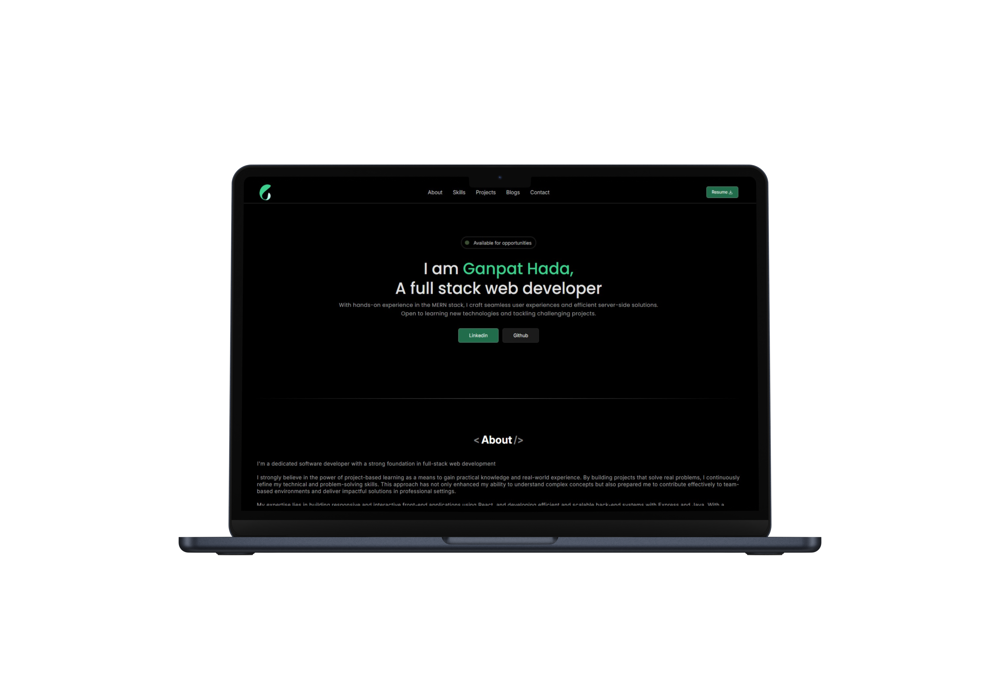
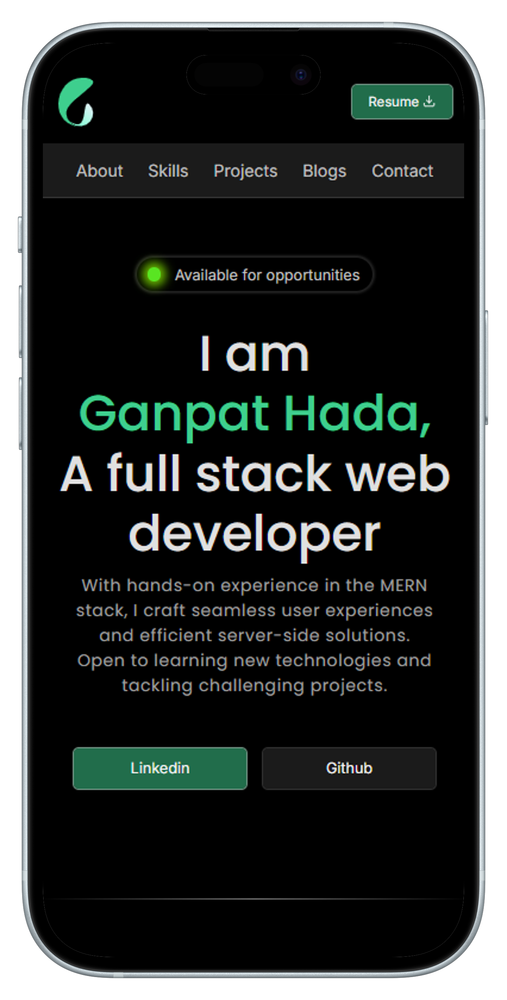

# Ganpat Hada's Portfolio website

Welcome, 👏Here is my [Portfolio](https://ganpathada22.netlify.app)

## 🖼 Portfolio preview (Desktop/Laptop)

## 🖼 Portfolio preview (Mobile)

---

## 🚀 Features

- **Responsive Design**: Works seamlessly on desktops, tablets, and mobile devices.
- **Projects Showcase**: Highlights my key projects with descriptions and live previews.
- **Skills Section**: Lists my technical skills and areas of expertise.
- **Contact Form**: Allows visitors to get in touch directly through the website.
- **Smooth Animations**: Provides an engaging user experience with animations and transitions.

---

## 🛠️ Built With

- **Frontend**: React.js
- **Deployment**: [Vercel](https://vercel.com/)
- **Version Control**: Git, GitHub
